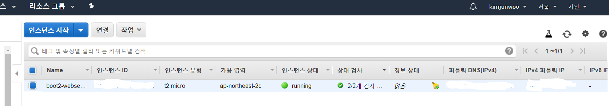

## 스프링 부트와 AWS로 구현하는 웹 서비스

### 참고
- [바로가기](https://jojoldu.tistory.com/463)

### 개발환경
- SpringBoot, JPA, mustache, 스프링 시큐리티 Oauth2, AWS, Bootstrap

### 주요기능
- 게시글 등록, 삭제, 수정 API
- 구글 API 로그인 연동
- 네이버 API 로그인 연동
- AWS EC2 서버 배포
- Travis CI 연동해서 배포 자동화

### 메인화면

### 글 작성

### 글 수정

- 게시글 수정 및 삭제 가능

### AWS EC2 배포

- windows라서 putty 활용

### travis CI 연결

